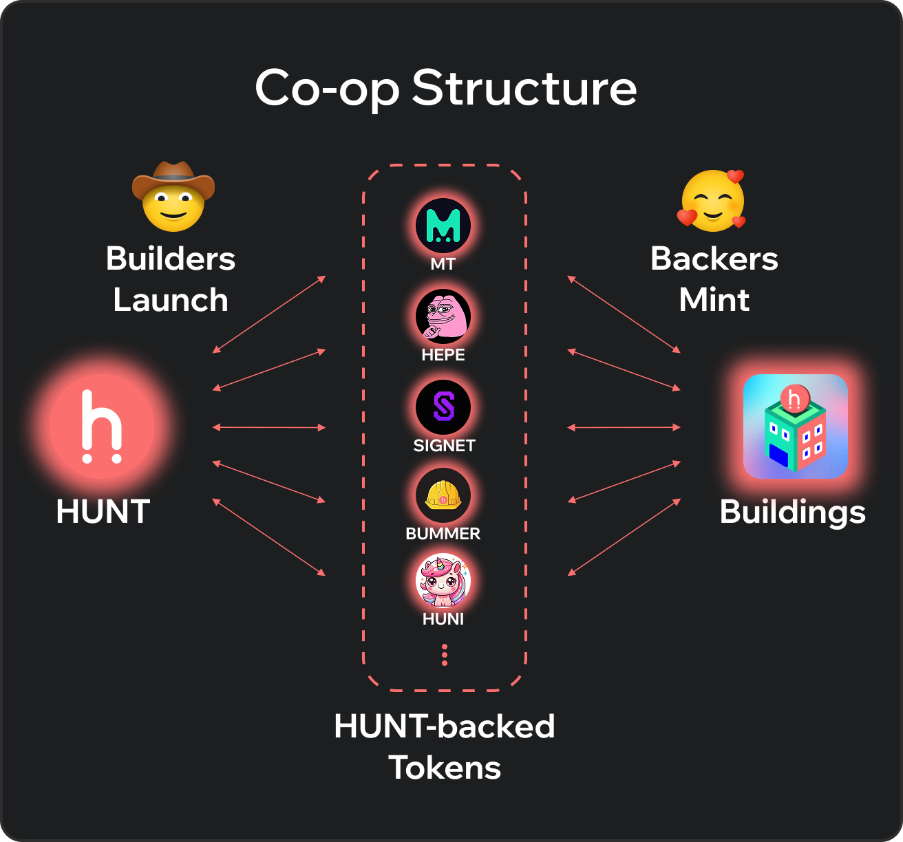

# Introduction

<figure><figcaption></figcaption></figure>

## What is [Hunt Town](https://hunt.town/)?

Hunt Town is the first onchain cooperative (Co-op) model for Web3 builders and backers. It’s a shared economy where builders launch tokens and backers mint them daily, creating a sustainable onchain ecosystem that grows together. Every project in the Co-op is backed by HUNT, the reserve token that connects all tokens and NFTs within the Hunt Town economy.

## The Co-op Model

<figure><figcaption></figcaption></figure>

Unlike traditional launchpads or isolated projects, Hunt Town connects all participants through a common reserve asset. As builders launch new tokens, a portion of HUNT becomes locked in bonding curve pools, while backers continuously mint and support projects with their daily Backing Points (BP). This structure naturally expands the Co-op’s Total Value Locked (TVL) and strengthens HUNT’s scarcity over time.

#### Builders and Backers


<mark style="background-color:orange;">**Builders**</mark>: Launch project tokens backed by HUNT and raise liquidity through the Co-op economy.



<mark style="background-color:green;">**Backers**</mark>: Support these projects by minting tokens daily with their BP or donating HUNT directly.\
The relationship is mutually beneficial — builders gain early traction, and backers earn rewards, royalties, and recognition for their support.



[builders-and-backers.md](how/builders-and-backers.md)


#### Project Tokens on Hunt Town

Every project launched in Hunt Town issues its token as a HUNT-backed child token using bonding curve mechanics. When these project tokens grow in market activity, more HUNT becomes locked inside their bonding curve pools. This means that even though each builder runs a completely independent project, all of them share upside value across the Co-op. The success of one project strengthens the foundation of HUNT — and by extension, every other token and NFT built within the Hunt Town economy.


[launch-a-project-token.md](how/launch-a-project-token.md)


#### Building NFTs

Backers in Hunt Town mint Building NFTs to increase their Backing Power, which determines how much support they can give to builders daily. Each Building NFT is backed by HUNT through its own bonding curve pool, locking more HUNT as demand for Buildings grows. Backers receive Daily BP (Backing Points) based on the number of Mini Buildings they hold, allowing them to mint their favorite project tokens each day. This creates a dynamic cycle — the more Buildings minted, the higher the Co-op’s locked value and the stronger the collective economy becomes.


[building-nfts.md](token/building-nfts.md)


#### The Role of HUNT

HUNT powers the Co-op economy as its reserve and deflationary asset. There is no inflation or minting — every project launch and NFT mint locks more HUNT into bonding curve pools, reducing circulating supply and amplifying long-term value for participants.


[hunt.md](token/hunt.md)



[hunt-as-the-reserve-token.md](how/hunt-as-the-reserve-token.md)


## Why the Co-op Matters

Most Web3 projects start alone, struggling to build liquidity, attract users, or sustain activity. Hunt Town redefines that by linking every project within a shared economy — where success in one project contributes to the strength of all. Builders, backers, and the entire ecosystem grow together, creating a more resilient and connected onchain network.


[hunt-backed-project-tokens.md](token/hunt-backed-project-tokens.md)

