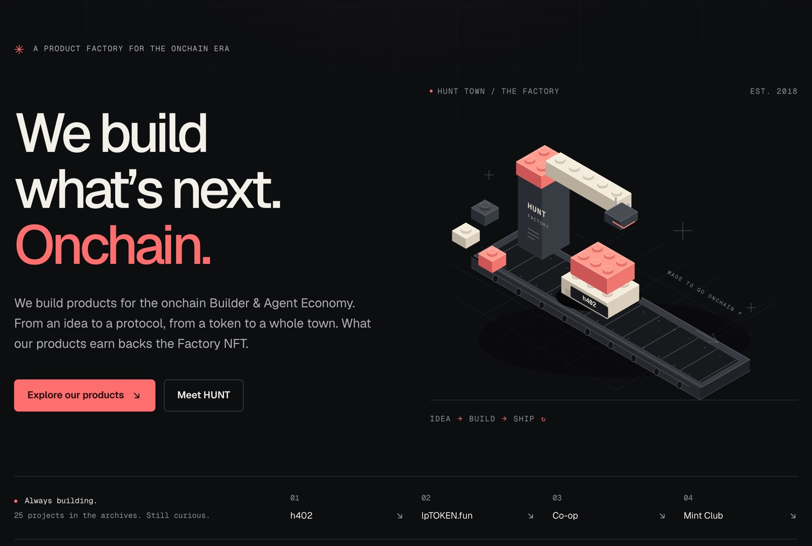
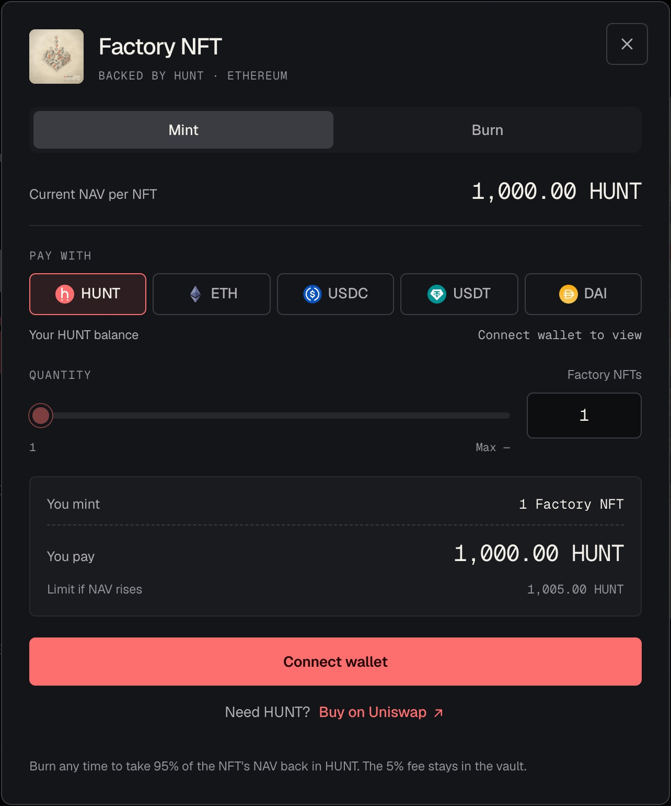
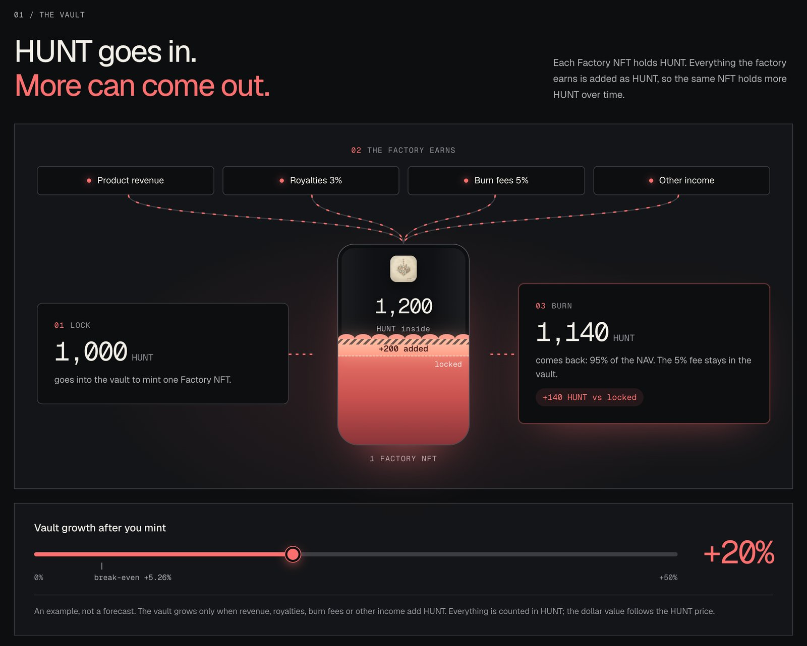
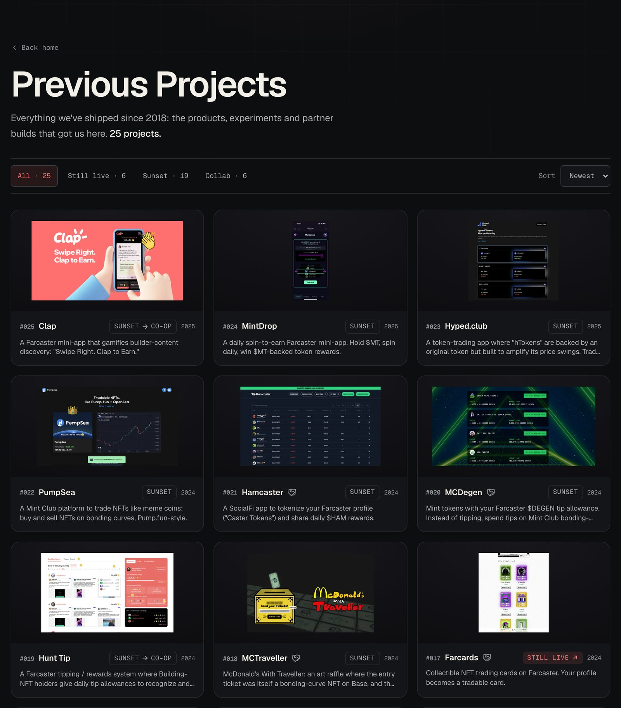
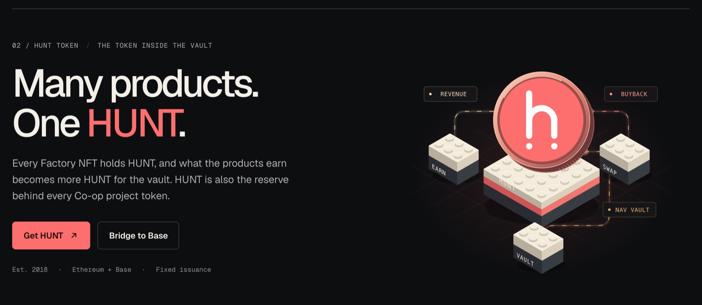

# Introduction

**Hunt Town is an Onchain Product Factory.** We have built onchain products since 2018, and
each one hands what it learned to the next. Product revenue backs one asset, the Factory NFT,
counted in HUNT.

<figure><figcaption>
hunt.town
</figcaption></figure>

## How Hunt Town works

**Build, ship, seed.** Every product follows the same arc. We build it on an onchain
primitive, ship it and run it, and when it retires, its mechanics and community seed the
next one. The products share one economy.


[The Factory Model](hunt-town/factory-model.md)


**The engine: the Factory NFT.** Product revenue buys HUNT and adds it to the Factory NFT
contract, which raises the NAV of every Factory NFT at once. The Factory NFT is an ERC-1155
token on Ethereum, backed by the HUNT its own contract holds. The contract cannot be
upgraded, and the owner cannot withdraw that HUNT.

<figure><figcaption>
The Factory NFT on hunt.town
</figcaption></figure>


[Factory NFT: Overview](factory-nft/overview.md)


**Mint and burn.** Mint at the current NAV per NFT, which started at 1,000 HUNT. Pay in
HUNT, or in ETH, USDC, USDT or DAI swapped to HUNT in the same transaction. Burn any time for
95% of the NAV in HUNT. The other 5% stays in the vault for the holders who remain.

<figure><figcaption>
Minting on hunt.town
</figcaption></figure>


[Mint & Burn](factory-nft/mint-and-burn.md)


**The vault.** Marketplace royalties add HUNT too. There is nothing to claim, no schedule
and no set amount, and no return is promised. The NAV is counted in HUNT, so its dollar value
follows the HUNT price.

<figure><figcaption>
How HUNT reaches the vault. The numbers are an example, not a forecast.
</figcaption></figure>


[The NAV Vault](factory-nft/nav-vault.md)


## Who we build for

The onchain Builder & Agent Economy: people who launch, trade and build onchain, and a
growing number of software agents that pay for the services they use. Each product we run
serves builders, agents, or both.


[The Builder & Agent Economy](hunt-town/builder-agent-economy.md)


## What runs today

The factory runs a small set of active products at a time, each built on an onchain
primitive and all sharing one economy. See the active products on
[hunt.town](https://hunt.town/#now). Each one also has its own section in these docs.

## Archived products

**We archive fast.** When a product does not work out, or leaves our main focus and runs in
maintenance mode, we archive it quickly and put the team's time and resources into new
products. Every archived product keeps a record of the bet, what worked, what broke and what
it seeded. See them all in the [Archives on hunt.town](https://hunt.town/build-log).

<figure><figcaption>
The Archives on hunt.town
</figcaption></figure>


[Archives](track-record/build-log.md)


## HUNT

**The token under the economy.** HUNT was issued once, 500,000,000 in total. No address can
mint more, and past burns removed about 60% of it. It backs the Factory NFT and is the
reserve behind HUNT-backed tokens.

<figure><figcaption>
HUNT on hunt.town
</figcaption></figure>


[HUNT (ERC20)](hunt/hunt-erc20.md)


**Supply.** Live burned, locked and circulating figures are on
[hunt.town](https://hunt.town/factory#supply). How they are counted is in Supply &
Distribution.


[Supply & Distribution](hunt/supply.md)

