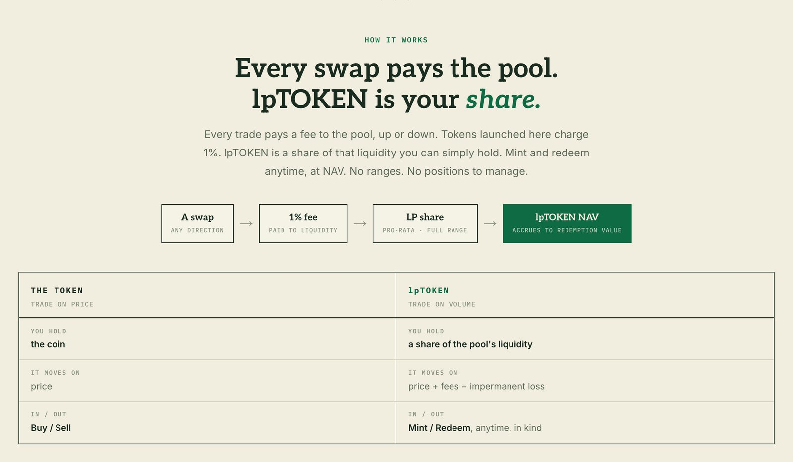

# Introduction

**Hunt Town is an Onchain Product Factory.** We have built onchain products since 2018, and
each one hands what it learned to the next. Product revenue backs one asset, the Factory NFT,
counted in HUNT.

<figure><figcaption>
hunt.town
</figcaption></figure>

## How Hunt Town works

**Build, ship, seed.** Every product follows the same arc. We build it on an onchain
primitive, ship it and run it, and when it retires, its mechanics and community seed the
next one. The products share one economy.


[The Factory Model](hunt-town/factory-model.md)


**The engine: the Factory NFT.** Product revenue buys HUNT and adds it to the Factory NFT
contract, which raises the NAV of every Factory NFT at once. The Factory NFT is an ERC-1155
token on Ethereum, backed by the HUNT its own contract holds. The contract cannot be
upgraded, and the owner cannot withdraw that HUNT.

<figure><figcaption>
The Factory NFT on hunt.town
</figcaption></figure>


[Factory NFT: Overview](factory-nft/overview.md)


**Mint and burn.** Mint at the current NAV per NFT, which started at 1,000 HUNT. Pay in
HUNT, or in ETH, USDC, USDT or DAI swapped to HUNT in the same transaction. Burn any time for
95% of the NAV in HUNT. The other 5% stays in the vault for the holders who remain.

<figure><figcaption>
Minting on hunt.town
</figcaption></figure>


[Mint & Burn](factory-nft/mint-and-burn.md)


**The vault.** Marketplace royalties add HUNT too. There is nothing to claim, no schedule
and no set amount, and no return is promised. The NAV is counted in HUNT, so its dollar value
follows the HUNT price.

<figure><figcaption>
How HUNT reaches the vault. The numbers are an example, not a forecast.
</figcaption></figure>


[The NAV Vault](factory-nft/nav-vault.md)


**Building NFTs.** Legacy Main and Mini Buildings turn into Factory NFTs, one way. Each
Building counts at the full HUNT it was minted with: locked Main Buildings are accepted, and
Mini Buildings lose nothing to the 5% burn royalty. Main Buildings migrate on Ethereum. Mini
Building migration from Base has not opened yet.

<figure><figcaption>
The migration portal
</figcaption></figure>


[Migrating Buildings](factory-nft/migrating-buildings.md)


## Who we build for

The onchain Builder & Agent Economy: people who launch, trade and build onchain, and a
growing number of software agents that pay for the services they use. Co-op, lpTOKEN.fun and
Mint Club serve builders. h402 serves agents.


[The Builder & Agent Economy](hunt-town/builder-agent-economy.md)


## What runs today

**h402.** The Agent Capability Market Layer, in beta. An agent mounts it once, finds a
capability in the catalog, pins a verified provider and pays per call in Base USDC over x402.

<figure><figcaption>
h402.hunt.town
</figcaption></figure>


[h402: Overview](h402/overview.md)


**lpTOKEN.fun.** One market, two ways to take part: the token and its fee-earning
liquidity. A Uniswap v4 liquidity position is wrapped in an ERC-20, so the LP side can be
held, moved and redeemed like any token. It runs on Robinhood Chain, Base, Arc and Ethereum.

<figure><figcaption>
lptoken.fun
</figcaption></figure>


[lpTOKEN.fun: Overview](lptoken/overview.md)


**Co-op.** A HUNT-backed launchpad and DEX at coop.hunt.town. Builders launch project tokens
on bonding curves with HUNT as the reserve, and anyone can buy or sell them against HUNT from
the moment they launch.

<figure><figcaption>
Launching a project on coop.hunt.town
</figcaption></figure>


[Co-op: Overview](co-op/overview.md)


**Mint Club.** The no-code bonding-curve protocol for tokens and NFTs. A creator picks a
reserve token and a curve and deploys, and the asset can be minted and burned against its
reserve from the start. Co-op tokens are issued on it.

<figure><figcaption>
mint.club
</figcaption></figure>


[Mint Club: Overview](mint-club/overview.md)


## What came before

25 previous projects since 2018. Each entry records the bet or the collab, what worked, what
broke, and what it seeded.

<figure><figcaption>
The Archives on hunt.town
</figcaption></figure>


[Archives](track-record/build-log.md)


## HUNT

**The token under the economy.** HUNT was issued once, 500,000,000 in total. No address can
mint more, and past burns removed about 60% of it. It backs the Factory NFT and is the
reserve behind Co-op project tokens and other HUNT-backed tokens on Mint Club.

<figure><figcaption>
HUNT on hunt.town
</figcaption></figure>


[HUNT (ERC20)](hunt/hunt-erc20.md)


**Supply.** Burned, locked and circulating HUNT, counted per chain from onchain reads.

<figure><figcaption>
The supply panel, with figures at capture time
</figcaption></figure>


[Supply & Distribution](hunt/supply.md)

