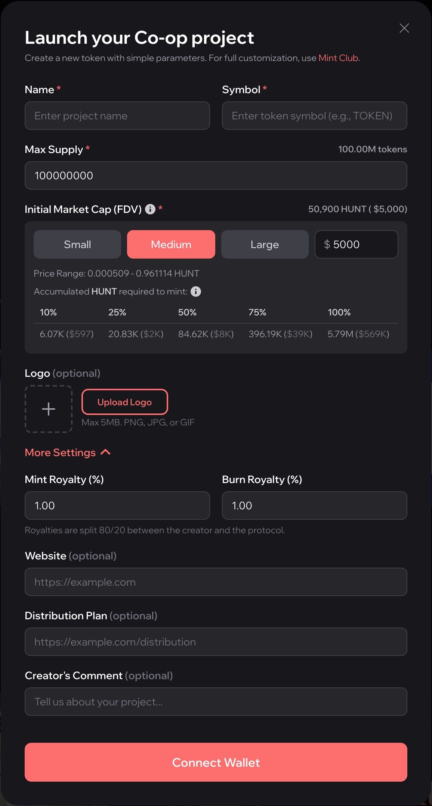

# Launch a Project Token

A builder launches a project token on the Co-op with a few settings. The Co-op fixes the
curve and the reserve, so every launch uses the same curve shape and the same reserve asset. For full control over the curve and the
reserve, a builder can launch on [Mint Club](../mint-club/overview.md) directly.

<figure><figcaption>
The launch form on coop.hunt.town
</figcaption></figure>

## What the builder sets

| Setting | What it does |
| --- | --- |
| **Name and symbol** | The symbol must not be taken already. |
| **Maximum supply** | 100,000,000 by default. Fixed at launch. |
| **Starting market value** | The fully diluted value at the first price, in dollars: $1,000, $5,000 or $30,000, or a custom amount. It is converted to HUNT at launch, and the first price is this value divided by the maximum supply. |
| **Royalties** | A mint royalty and a burn royalty, each from 0% to 50%, 1% by default. |
| **Project details** | Optional logo, website, distribution plan and a comment from the builder. |

## What the Co-op fixes

- **One preset curve.** Every Co-op token uses the same bonding curve. The price rises with
  supply and climbs steeply toward the maximum. Builders do not design a curve.
- **HUNT as the reserve.** Every token's reserve is HUNT on Base.
- **No free allocation.** The curve starts at a price, so the builder buys like anyone else.

## What it costs

Launching costs Mint Club's creation fee and gas, paid in ETH on Base. No HUNT is needed to
launch, and there is no required first buy. See [Economics](../mint-club/economics.md).

## What the builder gets

- **A market from the first block,** with no liquidity pool to seed and no listing to wait
  for.
- **Royalties on every trade,** paid in HUNT. The creator gets 80% and the protocol 20%.
- **A project page** on the Co-op, with project updates and Mini App links. The project
  details are stored as Mint Club token metadata, so they show on mint.club as well.
- **Mint Club's creator tools** for the token, such as lock-ups and bulk sends. The
  royalties can be moved to another wallet.

The symbol and the maximum supply are fixed at launch and cannot change.
