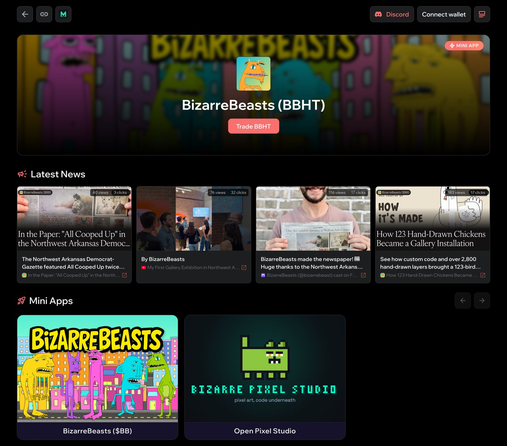

# Co-op: Overview

**Co-op is a HUNT-backed launchpad and DEX at [coop.hunt.town](https://coop.hunt.town).**
Builders launch project tokens on bonding curves with HUNT as the reserve, and anyone can
buy or sell them against HUNT from the moment they launch. Co-op runs on the
[Mint Club](../mint-club/overview.md) protocol on Base, and it is the most direct expression
of the [reserve-token](../hunt/reserve-token.md) thesis.

## How it works

```
   Builders ──launch──▶  HUNT-backed project tokens  ◀──buy / sell──  Anyone
                                  │
            each token keeps its own reserve, always in HUNT
```

- **Launch.** A builder creates a project token with a few settings: name, symbol, maximum
  supply, starting market value and royalties. It trades from the moment it launches, with
  no liquidity pool to seed and no listing to wait for. See
  [Launch a Project Token](launch-a-project-token.md).
- **Trade.** Buying mints the token on its curve and locks HUNT in its reserve. Selling
  burns the token and returns HUNT from that reserve. The price follows the curve as supply
  changes. See [Trading & the HUNT Reserve](trading.md).
- **One reserve asset.** Every project keeps its own reserve, and every reserve is HUNT. So
  each buy on any project locks more of the asset behind all of them.

## What's on the Co-op

- **A directory** of every token on Base that uses HUNT as its reserve, whether it was
  launched on the Co-op or on Mint Club.
- **Project pages** with the builder's comment, the token address, the website, the
  royalties and the distribution plan. Live stats show the price in dollars and in HUNT, the
  HUNT locked in the reserve, and the market value. Each page also shows who launched the
  token and who holds its royalties.
- **Project updates** that builders post for their community. Each update currently burns
  10 HUNT.
- **Mini Apps** that a project can list on its page.

<figure><figcaption><p>An example project page with its Latest News (project updates) and Mini Apps</p></figcaption></figure>

## Built on Mint Club

Every Co-op token is a Mint Club V2 token on Base, with HUNT as its reserve. The same token
appears on [mint.club](https://mint.club) with Mint Club's creator tools, such as lock-ups
and bulk sends. It can be traded there too, against the same curve. For a
custom curve or a different reserve, builders launch on Mint Club directly.

Co-op launched on December 3, 2025, after Clap ended.
