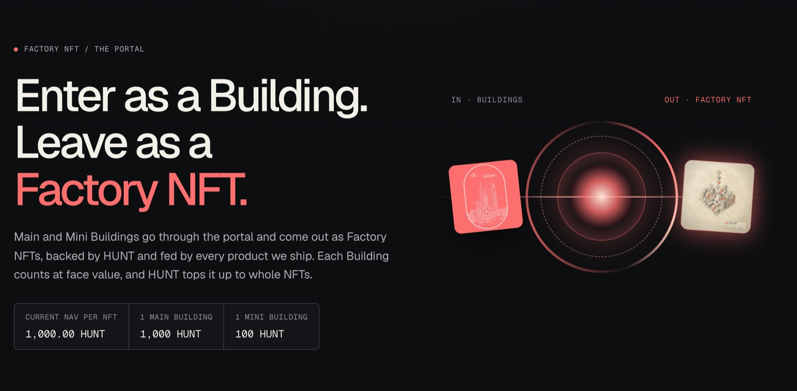
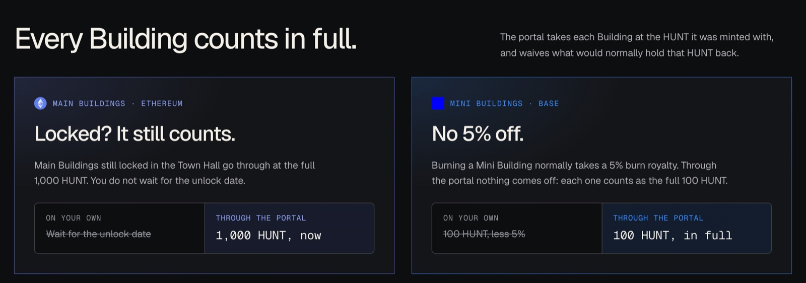
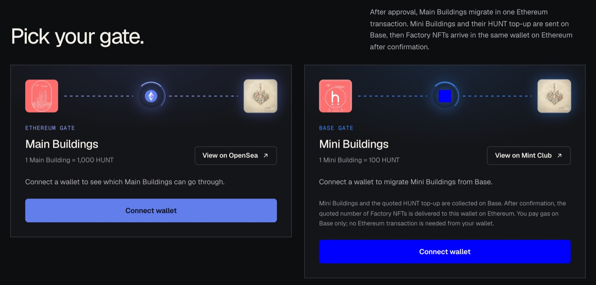

# Migrating Buildings

Building NFTs are Hunt Town's legacy NFTs. Holders can turn them into Factory NFTs. Each
Building counts at a fixed HUNT value, and you add HUNT to reach whole Factory NFTs.

Main Buildings migrate on Ethereum. Mini Building migration from Base has not opened yet.

<figure><figcaption>
The migration portal
</figcaption></figure>

## The rules

- **One way.** Migrated Buildings do not come back.
- **One chain at a time.** Main Buildings migrate on Ethereum in one transaction. Mini
  Buildings and their top-up are sent on Base.
- **Whole NFTs only.** There are no partial Factory NFTs and no refunds.
- **Factory NFTs arrive on Ethereum,** whichever chain you migrate from. From Base, the team
  confirms the deposit and then mints them to the same wallet on Ethereum.

| | Main Building | Mini Building |
| --- | --- | --- |
| **Network** | Ethereum | Base |
| **Counts as** | 1,000 HUNT each | 100 HUNT each |
| **Top-up paid in** | HUNT on Ethereum | HUNT on Base |

## Counted in full

The migration takes each Building at the HUNT it was minted with and waives what would
normally hold that HUNT back.

- **Locked Main Buildings count.** Main Buildings still locked in the Town Hall are accepted
  at the full 1,000 HUNT. You do not wait for the unlock date.
- **No 5% off Mini Buildings.** Each Mini Building counts as the full 100 HUNT it was minted
  with. The 5% burn royalty that applies when a Mini Building is burned on Mint Club is not
  taken off.

<figure><figcaption>
Every Building counts in full
</figcaption></figure>

## How many Factory NFTs

The Buildings' HUNT value is divided by the current NAV per NFT and rounded up to whole
Factory NFTs. The holder adds the difference in HUNT (the top-up), which is never refunded.

At a NAV of 1,000 HUNT per NFT, one Main Building or ten Mini Buildings make one Factory NFT
with no top-up. At 1,200 HUNT, ten Main Buildings plus 800 HUNT make nine Factory NFTs.

Migrate at [hunt.town/migrate](https://hunt.town/migrate).

<figure><figcaption>
One gate per chain. The Base gate has not opened yet.
</figcaption></figure>

## Where the HUNT comes from

Migration does not burn Buildings or take out the HUNT behind them. The team funds the
migration contract with HUNT, and the new Factory NFTs are minted from that HUNT at the full
current NAV, like any other mint. The migrated Buildings and the top-up go to a team wallet,
and the HUNT behind those Buildings stays where it is until the team redeems it.

## Legacy Buildings

Before the Factory NFT, Hunt Town's NFTs were Buildings. Each one was minted with HUNT, and
that HUNT stayed behind it.

- A **Main Building** (Ethereum, ERC-721) was minted with 1,000 HUNT through the Town Hall
  contract. The Town Hall holds that HUNT and records when each Building unlocks. Once a
  Building has unlocked, burning it releases the HUNT.
- A **Mini Building** (Base, ERC-1155) was minted with 100 HUNT through the Mint Club V2
  Bond on Base, which holds that HUNT in its reserve.

Addresses are in [Contracts & Addresses](../reference/contracts.md), and the audit of the
Town Hall and Building contracts is in [Links & Resources](../reference/links.md).
