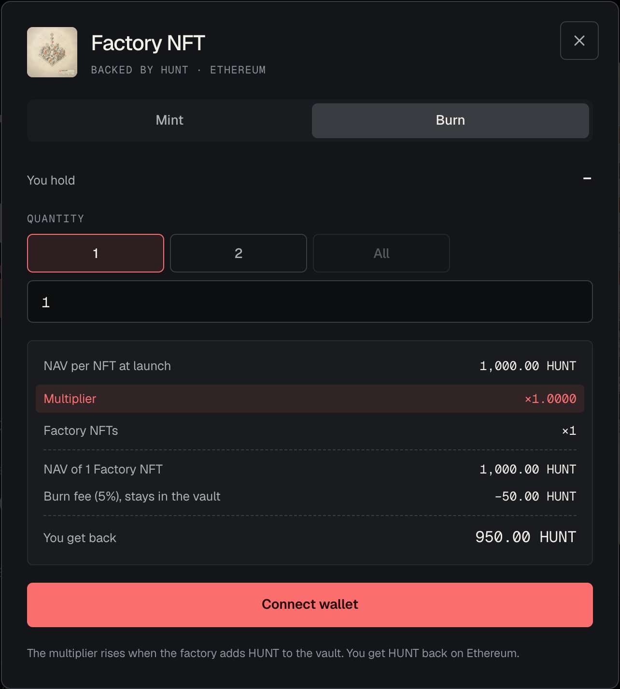

# Mint & Burn

Factory NFTs are minted and burned against the HUNT in the vault. There is no bonding curve
and no order book. Both use the NAV: the vault's HUNT divided by the number of NFTs.

## Mint

Minting creates new Factory NFTs at the current NAV.

```
HUNT to mint q NFTs = HUNT in the vault × q ÷ NFTs in supply
```

That works out to 1,000 HUNT × the multiplier for each NFT. At launch, one NFT locks 1,000
HUNT.

- **All of it goes into the vault.** The HUNT you lock stays in the Factory NFT contract and
  backs every NFT.
- **Existing holders are not diluted.** New NFTs bring in their full share of HUNT, so the
  NAV per NFT does not drop.
- **Pay with HUNT,** or with ETH, USDC or USDT swapped to HUNT through Uniswap v4 in the same
  transaction.

<figure><figcaption><p>Minting on hunt.town</p></figcaption></figure>

## Burn

Burning destroys Factory NFTs and sends you HUNT.

```
HUNT you receive = HUNT in the vault × q ÷ NFTs in supply × 95%
```

- **The burn fee is 5%.** It stays in the vault and raises the NAV per NFT for everyone
  still holding.
- **Only the holder can burn.** A burn takes NFTs from the burner's own wallet.
- **The last NFT stays.** Supply can never drop below one, so the last Factory NFT cannot
  be burned.

<figure><figcaption><p>Burning on hunt.town: the 5% fee stays in the vault</p></figcaption></figure>

## A worked example

At launch the vault holds 1,000 HUNT behind the one seed NFT.

1. Someone mints one NFT and locks 1,000 HUNT. The vault now holds 2,000 HUNT behind two
   NFTs, still 1,000 HUNT each.
2. They burn it straight away and receive 950 HUNT. The 50 HUNT fee stays behind.
3. The vault now holds 1,050 HUNT behind one NFT. The NAV per NFT is 1,050 HUNT, and the
   multiplier reads ×1.0500.

## What you get back in HUNT

```
HUNT back ÷ HUNT locked = 0.95 × multiplier at burn ÷ multiplier at mint
```

- Burn at the multiplier you minted at, and you get back 95% of the HUNT you locked.
- You get back more HUNT than you locked only after the multiplier has risen more than 5.26%
  since your mint.

Everything here is counted in HUNT, whose price can fall. No deposit is scheduled, so the
multiplier may not rise at all. No return is promised. See [Terms](../terms.md).
