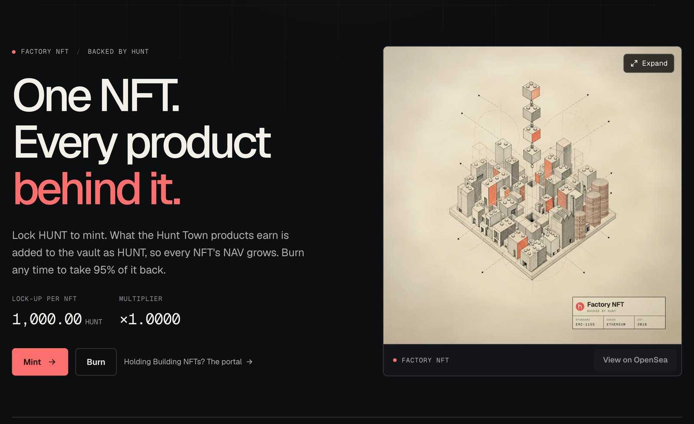
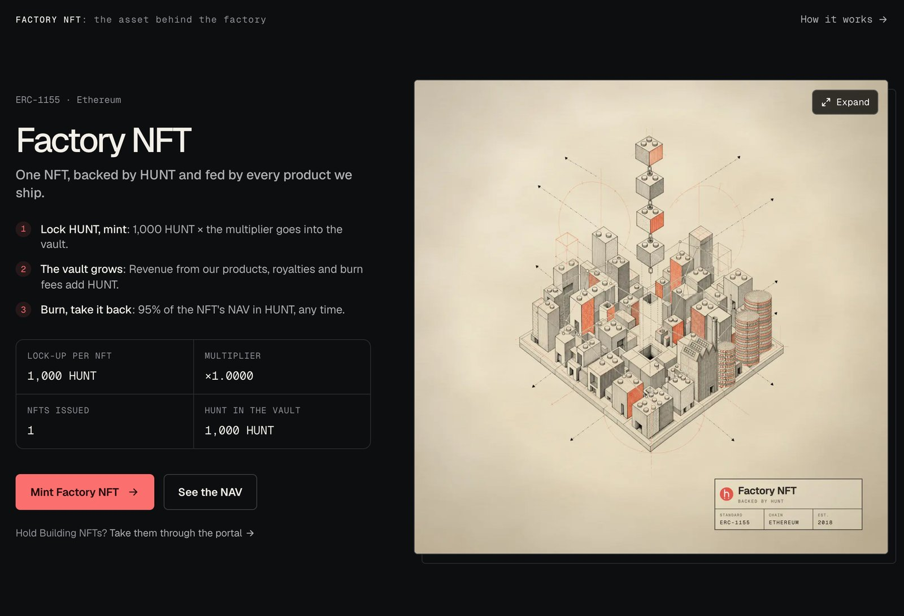

# Factory NFT: Overview

**The Factory NFT is the one asset that product revenue backs.** You lock HUNT to mint
one. Product revenue and marketplace royalties add more HUNT to the vault, which raises the
NAV of every NFT at once. Burn any time to take 95% of your NFT's NAV back in
HUNT.

<figure><figcaption>
The Factory NFT on hunt.town
</figcaption></figure>

## At a glance

| | |
| --- | --- |
| **Network** | Ethereum mainnet |
| **Standard** | ERC-1155, token id `0` |
| **Supply** | Unlimited. Minted at NAV, burned for 95% of NAV |
| **Lock-up per NFT** | 1,000 HUNT × the multiplier (1,000 HUNT at launch) |
| **Pay with** | HUNT, or ETH, USDC or USDT swapped to HUNT in the same transaction |
| **Backed by** | HUNT, held by the Factory NFT contract itself |
| **Minimum supply** | One. The last NFT cannot be burned |
| **Burn fee** | 5%, stays in the vault |
| **Marketplace royalty** | 3% |
| **Upgradeable** | No |

## How it works

1. **Mint at NAV.** Anyone can mint by locking the current NAV per NFT in HUNT.
2. **The vault grows.** Product revenue, marketplace royalties and other income add HUNT to
   the contract, with no schedule or set amount. Any HUNT added outside a mint raises the NAV
   per NFT for every holder at once. There is nothing to claim and no holding period.
3. **Burn for HUNT.** Burning an NFT redeems 95% of its NAV in HUNT. The other 5% stays in
   the vault, which raises the NAV for everyone still holding.

Details: [Mint & Burn](mint-and-burn.md) · [The NAV Vault](nav-vault.md).

<figure><figcaption>
The Factory NFT on the hunt.town home page
</figcaption></figure>

## NAV and the multiplier

**NAV per NFT** is the vault's HUNT divided by the number of NFTs. The **multiplier** is the
NAV per NFT divided by 1,000 HUNT: ×1.0000 at launch, and ×1.0500 once each NFT is backed by
1,050 HUNT. See [The NAV Vault](nav-vault.md#nav-per-nft).

## What the owner cannot do

The owner cannot withdraw the vault's HUNT, mint NFTs without HUNT behind them, or upgrade
the contract. See [Safeguards](nav-vault.md#safeguards).

## Counted in HUNT

The lock-up, the NAV and what a burn gives back are all counted in HUNT, and the dollar value
follows the HUNT price, which can fall. Because of the 5% burn fee, a burn can give back less
HUNT than you locked. No return is promised. See
[What you get back in HUNT](mint-and-burn.md#what-you-get-back-in-hunt) and
[Terms](../terms.md).

## Building NFTs

Main and Mini Building NFTs are legacy assets. Holders can turn them into Factory NFTs, one
way. See [Migrating Buildings](migrating-buildings.md).

## Where to use it

Mint, burn and live figures: [hunt.town/factory](https://hunt.town/factory).
