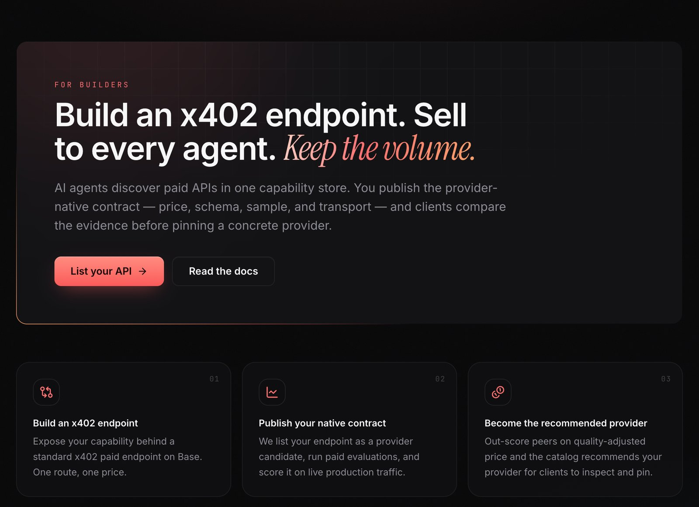

# For Builders

The other side of the market is the **API builders** who supply capabilities. h402 gives an
existing API a path to agent demand without building billing, key management, or a customer
relationship for every caller.

<figure><figcaption>
The Builders page
</figcaption></figure>

## What you get

- **Per-call monetization.** Your service is paid per call, over x402 in Base USDC or over
  Tempo MPP. No per-customer billing, no API keys to issue, no invoicing.
- **Agent-reachable distribution.** Once listed, your capability is discoverable by every
  agent that has mounted h402, found by the task it performs, not by your brand.
- **h402 handles the caller side.** h402 sits in front as the paid proxy: it presents the
  challenge to the caller, verifies the caller's signature, calls and pays your endpoint, and
  settles the caller's payment only after your response succeeds. Callers always pay in Base
  USDC, whichever way you are paid.

## How a listing works

1. **Expose an endpoint.** One capability, one price, reachable over HTTP.
2. **h402 adds it as a provider candidate** for the matching `category/action`, with your
   native input schema and an example.
3. **It is paid-probed, then ranked.** A real paid call must pass before the provider is
   enabled, and its live success rate, latency and price decide whether it becomes the
   recommended default. See [Providers & Verification](providers.md).

## How you get paid

h402 pays you from its operating wallet when it calls your endpoint, over x402 in Base USDC
or over Tempo MPP. The caller pays h402's treasury in Base USDC, and that payment settles
only after your response succeeds. Your price is what you set: the caller's quote is your
price plus h402's 5% markup, shown transparently before they authorize.

## Getting listed today

Listing is currently **reviewed by the h402 team** rather than self-serve. Submissions go
through the [Builders page](https://h402.hunt.town/builders) on the h402 site, and the team
runs the paid evaluation before a capability appears in the catalog.
