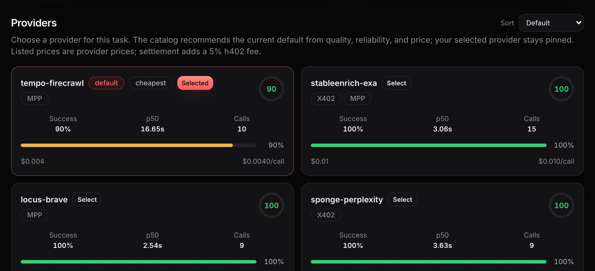

# Providers & Verification

A **capability** is a task. A **provider** is one concrete implementation of it. Before you
pay, the catalog shows each provider's price, its input schema and a sample of a real paid
response. That is enough to predict the cost and the shape of the result.

<figure><figcaption>
Providers of one capability, compared side by side
</figcaption></figure>

## Selection is explicit

**Every executable call is pinned to one provider.** The caller (a human, an agent, or the
CLI on the agent's behalf) chooses the provider before the call. There is no request-time
routing and no automatic failover to a different provider mid-call.

Every successful response records which provider served it, how that provider was chosen,
and how payment was handled, so each call can be audited afterwards.

### The recommended default

The catalog recommends a default provider for each capability, ranked by live success rate,
latency and price: a recommendation a client may pin, not a router.

## Verification is binary, and it is earned by paying

There is no verification score. A provider is either **enabled** or it is not, and *enabled
is the verification signal*:

- A provider becomes enabled only after a **real, paid probe** against its live endpoint,
  never from documentation, a mock, or an assumed response shape.
- The **exact response body** from that paid call is stored as the provider's **sample**.
  This is what the catalog shows you as a "real sample".
- A failed probe disables the provider.

## Quality score is a different thing

Separately from verification, each enabled provider carries a continuous **quality score**
derived from live call success rate and latency. It is used for **one purpose**: ranking
enabled providers so the catalog can recommend a default.
