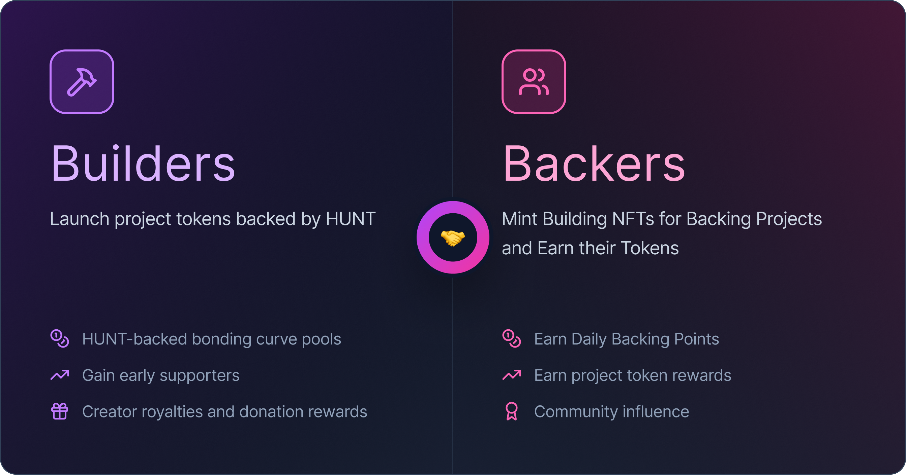

# 👷 Builders and Backers

<figure><figcaption></figcaption></figure>

The Co-op has two key participants:

#### 👷 Builders

* Launch project tokens that are backed by HUNT in their bonding curve pools.
* Gain early supporters who continuously mint their tokens using daily BP.
* Benefit from donation rewards, royalties, and visibility through the Co-op ecosystem.


[launch-a-project-token.md](launch-a-project-token.md)


#### 😘 Backers

* Mint Building NFTs to increase their daily BPs (Backing Points).
* Earn Daily BP from their Buildings and use it to mint project tokens they support.
* Receive HUNT-backed token rewards and recognition through leaderboards and community ranks.


[daily-backing-and-minting-flow.md](daily-backing-and-minting-flow.md)



[daily-backing-point-bp.md](daily-backing-point-bp.md)


The Co-op aligns both sides — builders gain reliable supporters, and backers accumulate ongoing value through their daily participation.
