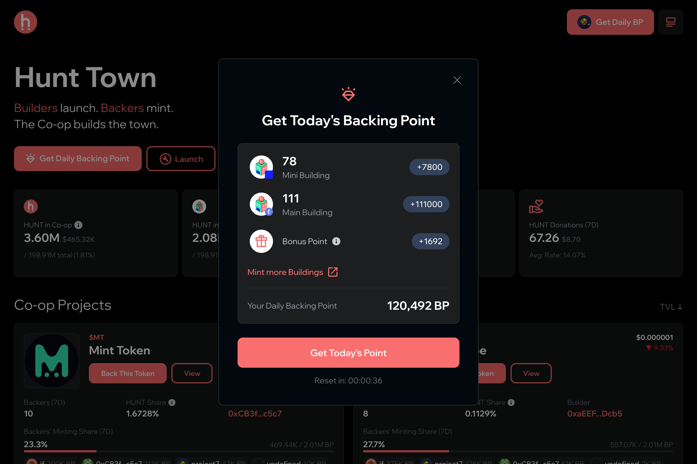
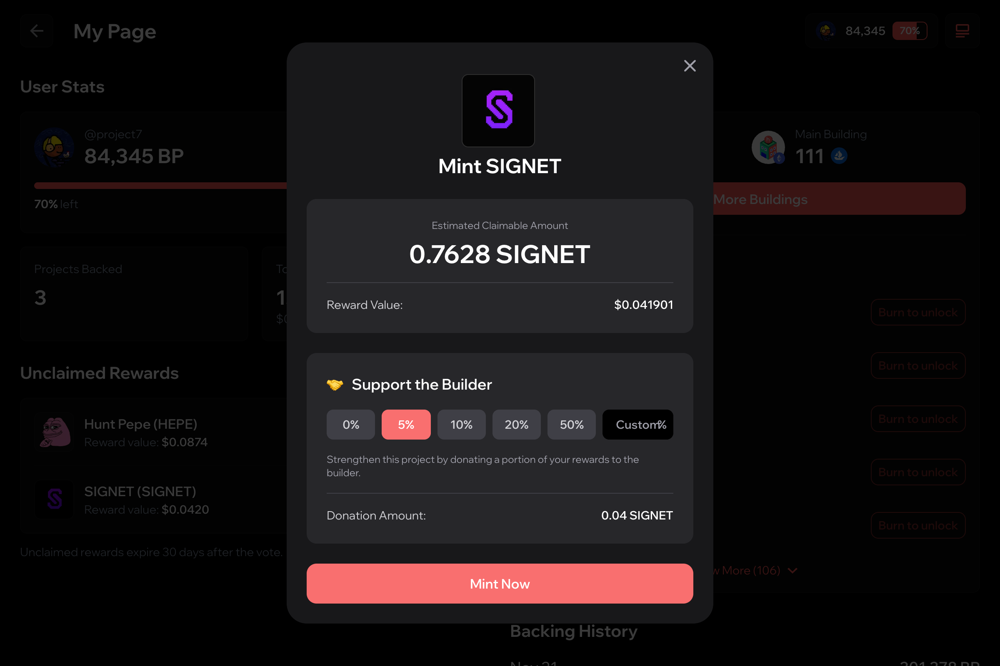

# 🤝 Daily Backing & Minting Flow

<figure><figcaption></figcaption></figure>

Each backer receives a set amount of Daily BP based on their Building NFT holdings. With these points, they can choose how to allocate their support among different projects on Hunt Town:

Select a project token to back.

<figure><figcaption></figcaption></figure>

Decide what percentage of BP to use and confirm your backing. You’ll be able to claim your tokens the next day on My Page.

<figure><figcaption></figcaption></figure>

The next day, their backed amount becomes claimable. This creates a rhythm of daily engagement between backers and builders, driving organic growth and liquidity within the Co-op.

<figure><figcaption></figcaption></figure>
