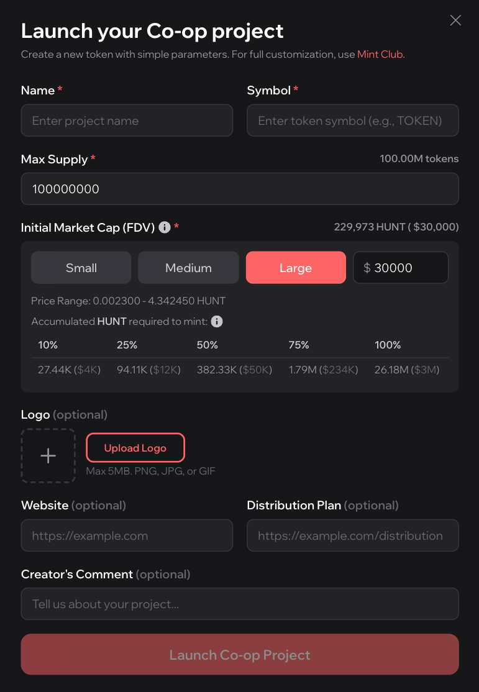

# 🚀 Launch a Project Token

#### Overview

Launching a project token on Hunt Town allows builders to create their own HUNT-backed tokens instantly through a simplified no-code interface. Each project token is deployed on Mint Club’s bonding curve protocol, ensuring built-in liquidity, transparent pricing, and shared value alignment with the Co-op economy.

This process connects your project’s growth directly to the HUNT ecosystem — as more users mint your token, more HUNT is locked in your bonding curve pool, contributing to Hunt Town’s total TVL and reducing HUNT’s circulating supply.

***

<figure><figcaption></figcaption></figure>

#### Step 1. Set Token Parameters

Before launch, builders define the basic parameters for their project token:

* Name: Your token’s public name (e.g., Mint Token).
* Symbol: A unique ticker symbol (e.g., $MT).
* Max Supply: The total number of tokens that can ever be minted.
* Logo (optional): Upload a project logo (up to 5MB in PNG, JPG, or GIF format).
* Website / Distribution Plan (optional): Add links for your project’s homepage or token plan.
* Creator’s Comment (optional): Leave a short introduction for backers about your project’s goal or mission.

***

#### Step 2. Set Initial Market Cap (FDV)

The Initial Market Cap (FDV) determines your token’s starting valuation and price curve. This value defines how your bonding curve starts — a higher FDV means a higher initial token price and deeper HUNT liquidity pool.


**FDV = Initial Price × Max Supply**


You can select from three preset tiers or enter a custom value:

| Tier   | Description                                        | Ideal For                             |
| ------ | -------------------------------------------------- | ------------------------------------- |
| Small  | Lower starting price and tighter curve.            | Early experiments and micro-projects. |
| Medium | Balanced curve between entry and growth.           | Most Co-op builders.                  |
| Large  | Higher starting liquidity and long-term potential. | Established or ambitious projects.    |

<figure><figcaption></figcaption></figure> <figure><figcaption></figcaption></figure> <figure><figcaption></figcaption></figure>

***

#### Step 3. Understand HUNT Accumulation

Each bonding curve requires HUNT accumulation as tokens are minted. This table shows the total HUNT needed to mint different percentages of your token supply.

*   Initial Market Cap (FDV): Total market cap if all tokens were circulating at launch. Calculated as:

    Initial Price × Max Supply _It represents your token’s starting valuation._
* Accumulated HUNT required to mint: Total HUNT needed to mint each percentage of tokens. It shows how much HUNT must accumulate in the bonding curve pool to reach every minting milestone.

By adjusting FDV and supply, builders can design token models that fit their project’s scale and sustainability goals.

***

#### Step 4. Launch Your Co-op Project

Once parameters are finalized, click Launch Co-op Project to deploy your token contract. Your project will immediately appear on the Hunt Town Co-op dashboard, where backers can start minting your tokens daily with their Backing Points (BP) or direct HUNT support.

Every new token launched expands the Co-op economy — locking more HUNT, driving deflationary growth, and strengthening the shared value network among all builders and backers.

<figure><figcaption></figcaption></figure>
