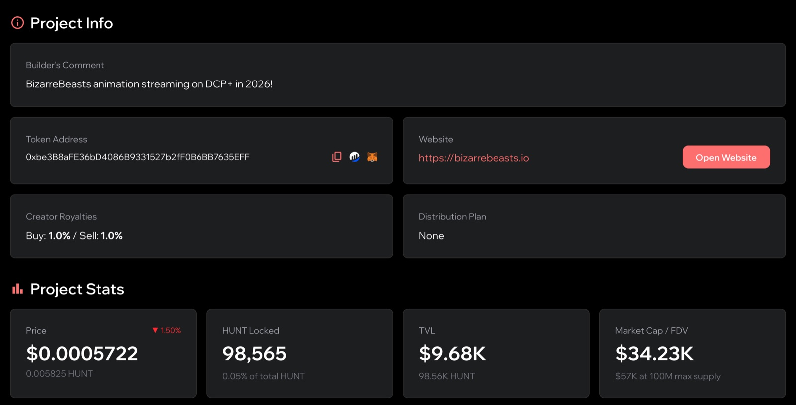
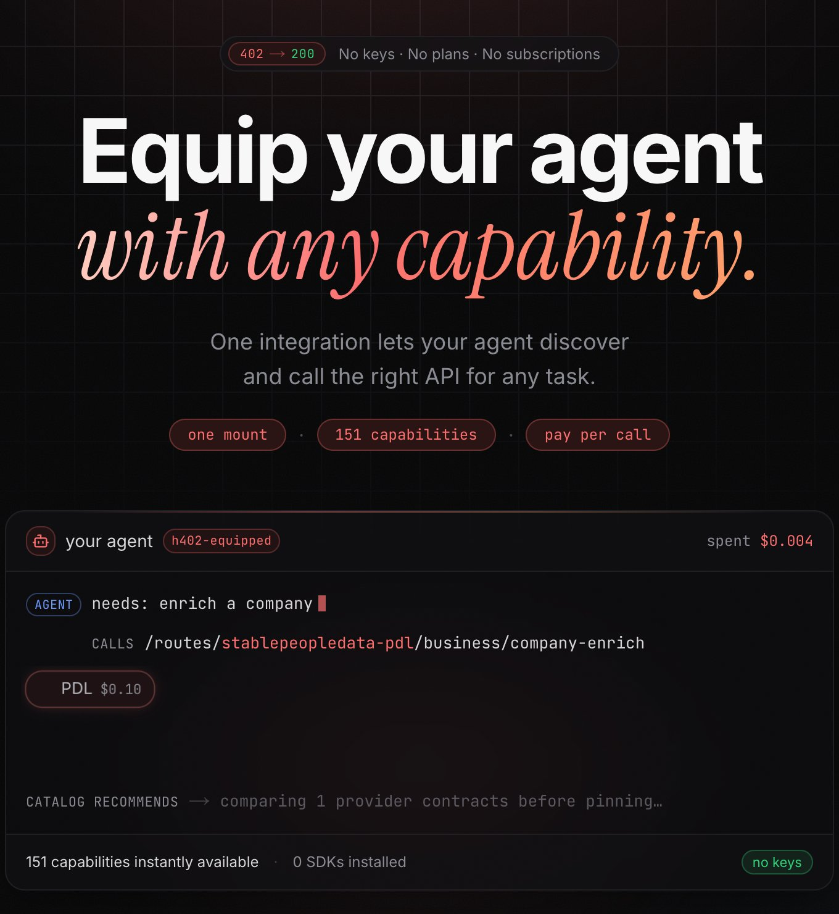

# The Builder & Agent Economy

Hunt Town builds for the onchain **Builder & Agent Economy**: the growing population of
people, and increasingly software agents, that create, transact, and coordinate onchain.
Builders and agents have the same underlying needs, and the factory's active products are
split across them.

## Builders

From the beginning, Hunt Town's bet has been that **token-incentivized communities can
out-create centralized platforms** when the people doing the work are rewarded directly.

That bet started with Steemhunt in 2018, a community that curated products and earned
crypto for it, and it has run through everything since: reward systems, NFT tooling, a
HUNT-backed launchpad.

The hard problem for onchain builders has always been the same: **most projects start
alone**, struggling to bootstrap liquidity, attract users, and stay alive long enough to
matter. The factory's answer is a shared economy where projects are connected through a
common reserve asset, so the success of one strengthens the foundation under all of them.

<figure><figcaption>
An example Co-op project, backed by HUNT. Figures at capture time.
</figcaption></figure>

## Agents

The newer half is **agents**. Autonomous software is starting to do real economic work
(calling APIs, buying data, generating media, completing tasks), and it needs a way to **pay
for what it uses without a human in the loop and without custodial accounts**.

Traditional rails assume a person with a card, an account, and a billing relationship per
vendor. That does not survive contact with an agent that needs dozens of services, once
each, at machine speed.

<figure><figcaption>
h402: agents pay per call
</figcaption></figure>

## Which product serves which half

The active products map onto the two halves:

| Product | Primarily serves | What it provides |
| --- | --- | --- |
| [h402](../h402/overview.md) | **Agents** | A capability market an agent mounts once, then uses to discover a capability, choose a verified provider, and pay per call in stablecoins. |
| [lpTOKEN.fun](../lptoken/overview.md) | **Builders** | A market from day one: a token and its fee-earning liquidity, both holdable. |
| [Co-op](../co-op/overview.md) | **Builders** | A HUNT-backed launchpad and DEX: builders launch tokens, and anyone can trade them against HUNT. |
| [Mint Club](../mint-club/overview.md) | **Builders** | The no-code bonding-curve protocol that Co-op and other HUNT-backed tokens are issued on. |

The [Factory NFT](../factory-nft/overview.md) is where the products connect: product revenue
buys the HUNT that backs it.
