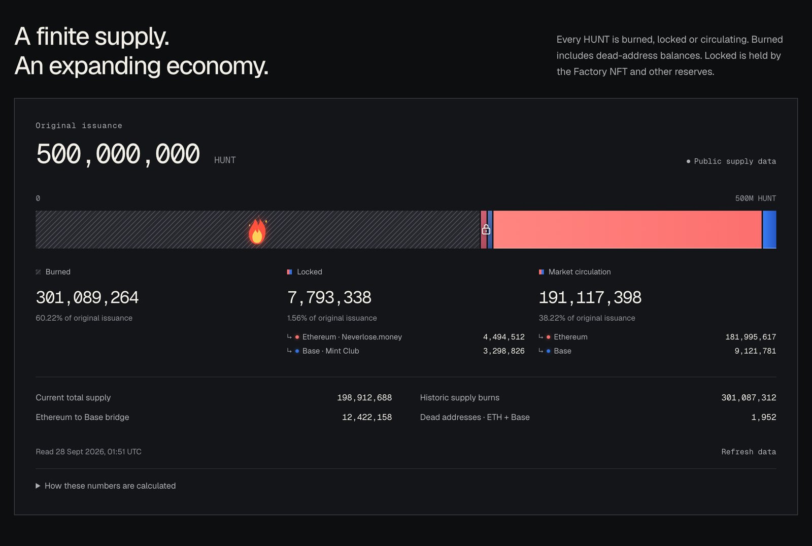

# Supply & Distribution

HUNT was issued once and no address can mint more. Supply is tracked as burned, locked and
circulating.

## Fixed issuance

| | |
| --- | --- |
| **Original issuance** | 500,000,000 HUNT |
| **Inflation** | None. No address can mint, and there is no emission schedule |
| **Canonical chain** | Ethereum |

The HUNT contract has a minter role, but its only minter was removed on February 19, 2024.

Total supply is read from the canonical **Ethereum** contract. HUNT on Base is bridged and
backed 1:1: the HUNT held by the Ethereum → Base bridge stands for all of the HUNT on Base,
so Base is accounted for inside that balance rather than added on top. See
[Base HUNT (Bridged)](base-hunt.md).

## Three categories

Every HUNT falls into exactly one of three live categories:

- **Burned:** removed from supply for good, by past burns or by sitting at the dead address.
- **Locked:** still exists but is committed: held by the Factory NFT contract, time-locked in
  the Neverlose.money vault, or sitting in the reserves of Co-op and other Mint Club tokens on
  Base.
- **Market circulation:** what remains, held in wallets, on exchanges, and in liquidity
  pools.

Notes on method:

- Legacy Building NFTs do not count as locked. The HUNT behind Main Buildings (held by the
  Town Hall) and behind Mini Buildings counts as circulating. When the Factory NFT launched,
  that HUNT moved from locked to circulating.
- Market circulation is computed from onchain reads. It is **not** an exchange-reported
  float, and it may differ from third-party circulating-supply figures.

None of this is a promise about price.

<figure><figcaption>
The supply panel on hunt.town/factory, with figures at capture time
</figcaption></figure>

## Live figures

Live burned, locked and circulating figures, split by chain:
**[hunt.town/factory](https://hunt.town/factory#supply)**. The reduction from 500,000,000 to
today's total supply is recorded event by event in
[Buyback & Burn](buyback-and-burn.md#the-historical-record).
