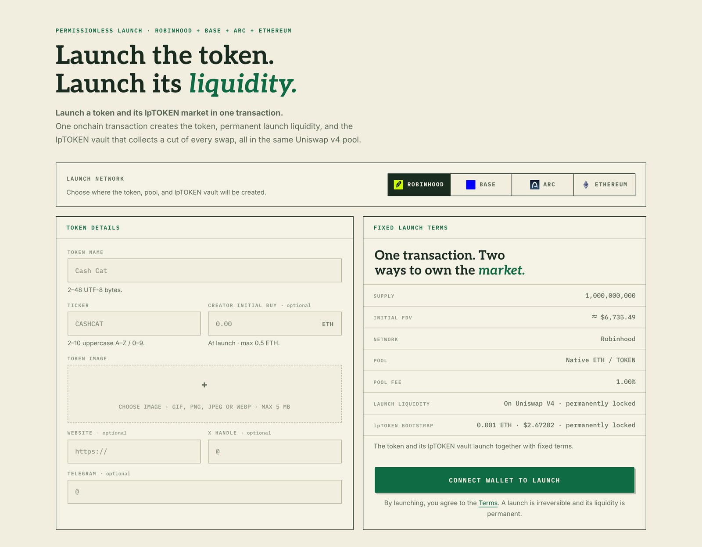

# Dual Launch

A **dual launch** creates a token and its LP vault in the same transaction, so a new market
opens with liquidity already in place and its LP side already tokenized.

<figure><figcaption>
The launch form and its fixed terms
</figcaption></figure>

## What happens at launch

1. A fixed-supply token is deployed: **1,000,000,000** tokens, minted once, with no mint,
   burn, or pause function anywhere afterwards. The creator can edit presentation metadata
   (image, website and social handles) and nothing else.
2. The pool is initialized: **native currency against the new token** (ETH, or USDC on
   Arc), at a **1%** LP fee.
3. Part of the supply opens a **permanent one-sided launch position**.
4. The **LP vault** is bootstrapped over the same pool, making the LP side an lpTOKEN from
   the first block.
5. Optionally, the creator's own first buy executes in the same transaction.

Both the launch position and the vault sit in **one pool**: the same price, the same fee
accounting. There is no second pool to keep in sync.

## Initial shares are burned

On a platform launch, **the entire initial share supply** minted at bootstrap goes to a
**dead address**.

Nobody (creator, protocol, or team) holds the opening lpTOKEN supply. It cannot be
redeemed, sold, or unlocked. Every lpTOKEN share that circulates afterwards was minted by
someone depositing real assets into the vault.

## The permanent launch position

The launch position is one-sided: it starts entirely in the new token and covers **every price
above the launch price**. Nobody can withdraw it.

Its purpose is **standing bid depth** that cannot be pulled. The native currency buyers pay
into it stays in the position as bids, down to the launch price.

## The floor that grows with volume

Because the launch position permanently earns fees, and a share of those fees is routed
into vault NAV, the floor **compounds with cumulative trading volume** rather than being fixed
at the size of the initial deposit. The launch's initial vault shares are burned, so the part
of NAV they hold can never be redeemed.

Roughly, per the product's own methodology:

- about **0.20%** of buy volume accrues to vault NAV in the counter currency, and
- about **0.60%** of sell volume accrues in the target token.

Compounding pairs that into bid depth that can never be withdrawn. Whatever cannot be paired
stays idle in the vault, and only the part held by the burned shares is permanent.

> **This is depth, not a price guarantee.** It does not promise any price, return, or floor
> level. See [Risks](risks.md).

## Curated vaults are different

A **curated LP vault** opens on a pool that already exists. It has no launchpad hook, no
one-sided launch position, no launch-fee split, and therefore **no permanent floor**. It is
purely mint, redeem, and compound on that pool.

The team curates which existing pools get a vault.
