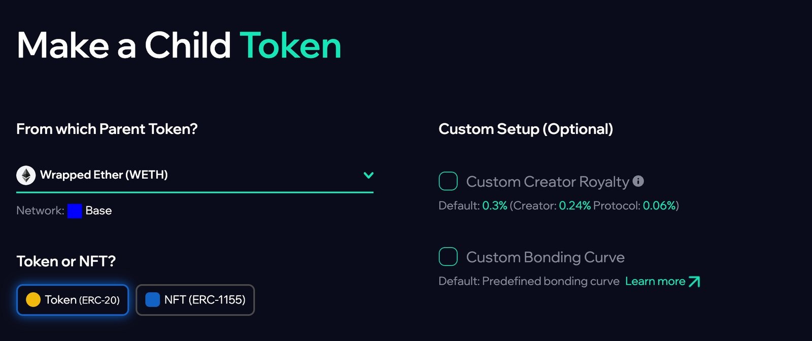

# Bonding Curves

A **bonding curve** is the heart of Mint Club. It is a smart contract that defines the price
of a token as a function of its supply: as more is minted, the price moves along the curve;
as supply is burned, it moves back. The curve **is** the market. There is no external
liquidity pool to seed.

## How a curve works

Trading an asset means **minting** (buying) or **burning** (selling) against its curve. There
is no order book and no counterparty: every trade is with the curve itself.

- Every asset is backed by a **reserve** of a chosen reserve token, held in the curve.
- **Minting (buying)** deposits reserve and issues new supply along the curve.
- **Burning (selling)** removes supply and returns reserve along the curve.
- Price is **deterministic**: it depends only on where you are on the curve, so there is
  always a quotable mint/burn price and instant liquidity.

A creator royalty can apply to each mint and burn. See [Economics](economics.md).

## Curve types

Creators choose the **shape** of the curve:

| Curve | Behavior |
| --- | --- |
| **Linear** | Price rises steadily with supply. |
| **Exponential** | Price accelerates as supply grows. |
| **Hyperbolic** | Price rises slowly at first, then faster as the remaining supply runs low. |
| **Logarithmic** | Price rises fastest early, then levels off. |
| **Flat** | Price stays constant. |

## Creating an asset

<figure><figcaption>
Creating a child token on Mint Club
</figcaption></figure>

Anyone can deploy an asset on a curve with no code: a **token** (ERC-20) for a project or
community, or an **NFT** (ERC-1155) for memberships and collectibles. The creator sets the
name, ticker and metadata, the **reserve token**, the curve type and its price steps, and
supply limits such as a maximum supply. The asset is live on its curve right away, with no
listing step.

Each asset is a standard ERC-20 or ERC-1155 token on open contracts, so other teams can
build products on it, as several in the [Archives](../track-record/build-log.md) did.

## Reserve backing and refunds

Because the reserve is held in the curve, the model is **reserve-backed and refundable**: a
holder can always burn back to the curve and reclaim reserve. Redemption follows the curve
across the amount burned, less any burn royalty.

In the Hunt Town economy, the reserve token is frequently **HUNT**, which is how Co-op
project tokens (and the legacy Mini Buildings) are [HUNT-backed](../hunt/reserve-token.md).
