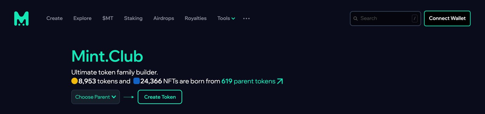

# Mint Club: Overview

**Mint Club is a no-code bonding-curve protocol** for creating and trading tokens and NFTs.
Anyone can deploy a token (ERC-20) or an NFT collection (ERC-1155) on a customizable bonding
curve, with no smart-contract code and no seeded liquidity pool, and the asset is instantly
mintable and burnable against its reserve.

For Hunt Town, Mint Club is both an **active product** and the **protocol primitive** that
much of the ecosystem is built on: Co-op project tokens, legacy Mini Buildings, and many of the
products in the [Build Log](../track-record/build-log.md) (1s.market, Memberify, Farcards,
MCDegen, Hamcaster, PumpSea, Hyped.club, MintDrop) were issued on Mint Club's curves.

<figure><figcaption>
The Mint Club home page
</figcaption></figure>

## What you can do

- **Create** an ERC-20 token or ERC-1155 NFT on a bonding curve, choosing the curve shape
  and the reserve token that backs it.
- **Mint and burn** against the curve: buying mints new supply and pushes price up along the
  curve; selling burns supply and returns reserve.

See [Bonding Curves](bonding-curves.md).

## Creator tools

No-code tools for running an asset after launch:

- **Airdrops** of tokens or NFTs to a list of recipients.
- **Lock-ups** that hold supply for a set period, for vesting or team allocations.
- **Free minting** by the creator under set conditions, for distribution, seeding or rewards.
- **Ownership transfer** to another address, such as a multisig or a DAO.
- **Royalty claims** for the royalties the creator earns on trading. See
  [Economics](economics.md).
- **Logo and website** for how the asset is shown.

Everything the no-code interface does is also available from code through the Mint Club V2
SDK: [sdk.mint.club](https://sdk.mint.club).

## How it relates to HUNT

Mint Club supports many reserve tokens, but it is tightly woven into the Hunt Town economy:
**HUNT-backed** tokens use HUNT as their reserve (the basis of the
[Co-op](../co-op/overview.md)), and Mint Club's own platform token, **MT (Mint Token)**, is itself
a HUNT-backed child token. See [MT (Mint Token)](mint-token.md).

> Full product docs: [docs.mint.club](https://docs.mint.club).
